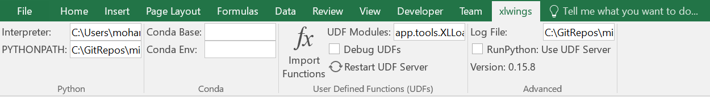

# A step-by-step development guide
## Instructions
This project is based on python, xlwings and Excel. Excel is the user interface for inputs and outputs. Python is the preferred programming language for implementing the optimization logic. Xlwings is what glues both.
In order to start developing in the project, one has to setup the environment:
*	Python: install Anaconda, pandas, numpy
*	xlwings: install the package using conda
*	Git: source code is hosted in Bitbucket server
*	PyCharm: IDE for python code
## xlwings
xlwings is a package that ships usually with Anaconda. Otherwise it can be installed using:
```bash
$> conda install -c anaconda xlwings
```
Excel has to be configured in order to load the xlwings addin:
*	Enable Trust access to the VBA project object model under File > Options > Trust Center > Trust Center Settings > Macro Settings
*	Install the add-in via command prompt
```bash
$> xlwings addin install
```
This will add the xlwings addin to Excel ribbon:
\
You might need to add xlwings.xlam addin manually by opening Excel and going to File > Options > Addins > Go > Browse.
As shown in the picture above, some variables have to be set as illustrated below:
*	Interpreter: C:\Users\xx\AppData\Local\Continuum\anaconda3\pythonw.exe
*	PYTHONPATH: C:\GitRepos\mine2farm
*	UDF Modules: app.tools.XLLoader
*	Log File: C:\GitRepos\mine2farm\app\sample.log
For more details, visit http://docs.xlwings.org/en/stable/index.html
Open VBA (Alt+F11) and add a reference to xlwings.xlam in Tools > References... by checking xlwings check box.
Set a new environment variable ANACONDA_HOME to anaconda root folder.
Extend PATH environment variable with:
*	%ANACONDA_HOME%
*	%ANACONDA_HOME%\Scripts
*	%ANACONDA_HOME%\Library\bin
*	%ANACONDA_HOME%\usr\bin
*	%ANACONDA_HOME%\mingw-w64\bin
## Git
Create folder C:\GitRepos. Under this folder, run following command:
```bash
$> git clone https://mmakkouh@bitbucket.org/mmakkouh/mine2farm.git 
```
If you choose not to install the code in C:\GitRepos, set the environment variable JESA_MINE2FARM_HOME to point to the installation folder.
At the end, you need to generate the environment file by running app/batches/generate_env.bat.
## Excel
You can run one the samples under C:\GitRepos\mine2farm\samples. You might need to check the reference to xlwings under VBA settings>Tools.
## Gurobi (optional)
*	Download and install Gurobi into C:\gurobi810
*	Copy/Paste Gurobi license file into C:\gurobi and set an environment variable GRB_LICENSE_FILE with value as path to license file
*	Open mine2farm project in PyCharm, go to File > Settings > Project > Project Structure
*	On the right panel, click Add Content Root and type C:\gurobi810\win64\python37\lib\gurobipy
You might need to install gurobi from Anaconda as well:
```bash
$> conda config --add channels http://conda.anaconda.org/gurobi
$> conda install gurobi
```
## PyInstaller
PyInstaller packages the python scripts into a standalone folder with an executable:
```bash
$> pip3 install pyinstaller
$> pyinstaller my_program.py
```
The package generation might not work right away. Among the reasons is the absence of PyQt package. If that's the case, you just need to run the following command:
```bash
$> pip3 install PyQt5
```
LPSolve (optional)
```bash
$> conda install -c conda-forge lpsolve55
```
## MongoDB
Install mongodb from official website along with MongoDB Compass. After installation, create the following directory:\
C:\data\db\
And add the following to you path environment variable:\
C:\Program Files\MongoDB\Server\4.0\bin\
Python support MongoDB via multiple libraries, and we've chosen pymongo as our preferred library:
```bash
$> conda install pymongo
```
## memcached
memcached is our preferred caching tool. You need to download it from http://downloads.northscale.com/memcached-win64-1.4.4-14.zip and unzip it under C:\memcached. Then, create start.bat under the same directory with the following line:
```bash
memcached.exe -m 128
```
In PyCharm, open "File > Settings > Tools > External Tools" and add a new task executing start.bat. This task should now be available from "Tools > External Tools" menu. Run it, then check memcached_sample.py.
## RabbitMQ
Follow instructions from RabbitMQ web page: https://www.rabbitmq.com/install-windows.html#installer
## Tableau Dashboard
*	Download and install tableau desktop from official website  https://www.tableau.com/fr-fr/products/reader/download
*	Download and install MongoDB Connector for BI from official website https://www.mongodb.com/download-center/bi-connector
Open "Program Files > MongoDB > Connector for BI > 2.12 > bin > mongosqld.exe" wait for connections then note the port and server used by mongoDb connector for BI.
Open Tableau desktop then specify the server and port for connection.